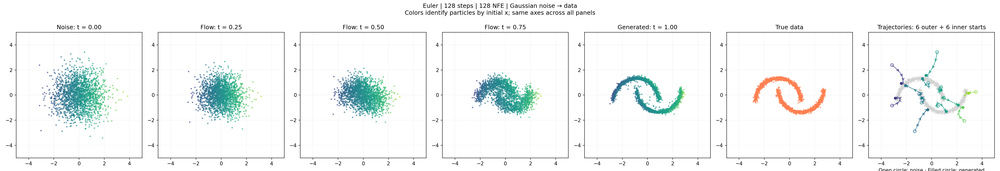
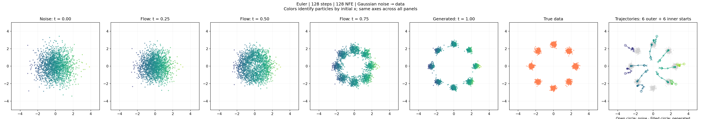
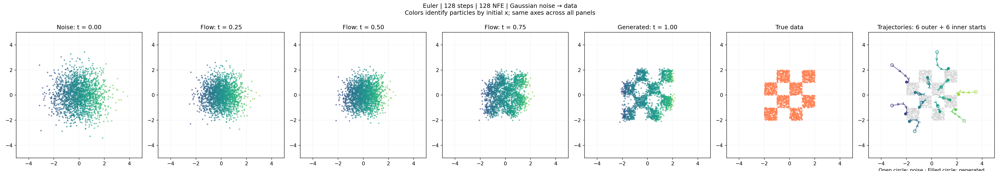

# 01 · 2D Flow Matching

A minimal PyTorch implementation of 2D flow matching on CPU.

## Conda setup

From the repository root:

```bash
cd 01-2d-flow-matching
conda create -n flow-matching python=3.11 -y
conda activate flow-matching
pip install -r requirements.txt
```

## Train

```bash
python train.py --dataset moons
python train.py --dataset 8gaussians
python train.py --dataset checkerboard
```

Default: 35,000 training steps, seed 42. Saves `model.pt`, `config.json`, and `summary.png` to `runs/<dataset>-<timestamp>/`.

## Eval

Replace the checkpoint path with your training output.

```bash
python eval.py runs/<dataset>-<timestamp>/model.pt --ode-steps 128 --samples 2000
```

Runs Euler sampling on CPU and saves `euler_128.png` next to the checkpoint.

## Results

35,000 training steps · 128 Euler steps · 2,000 samples.

### Moons



### 8 Gaussians



### Checkerboard


