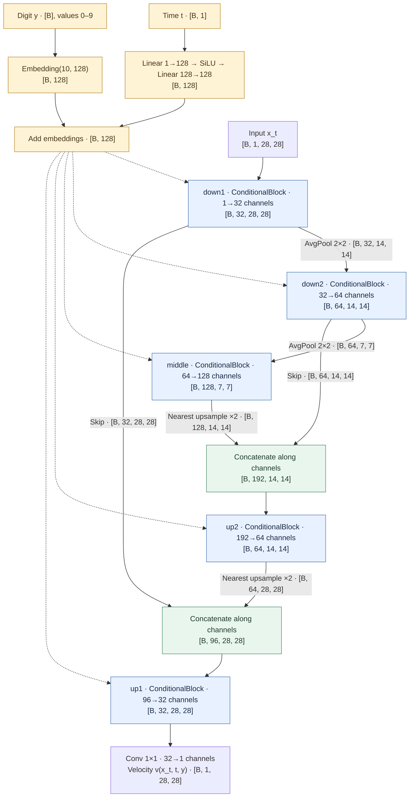
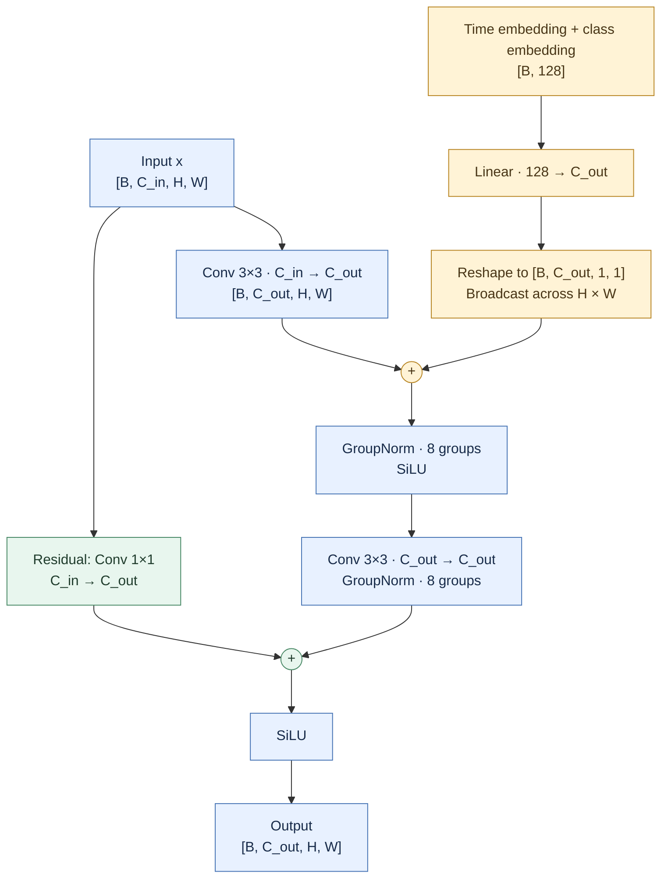
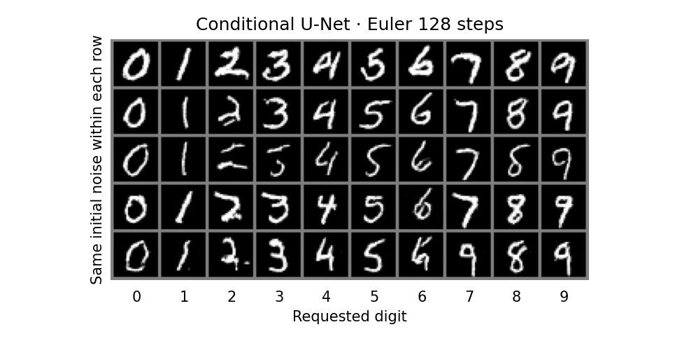
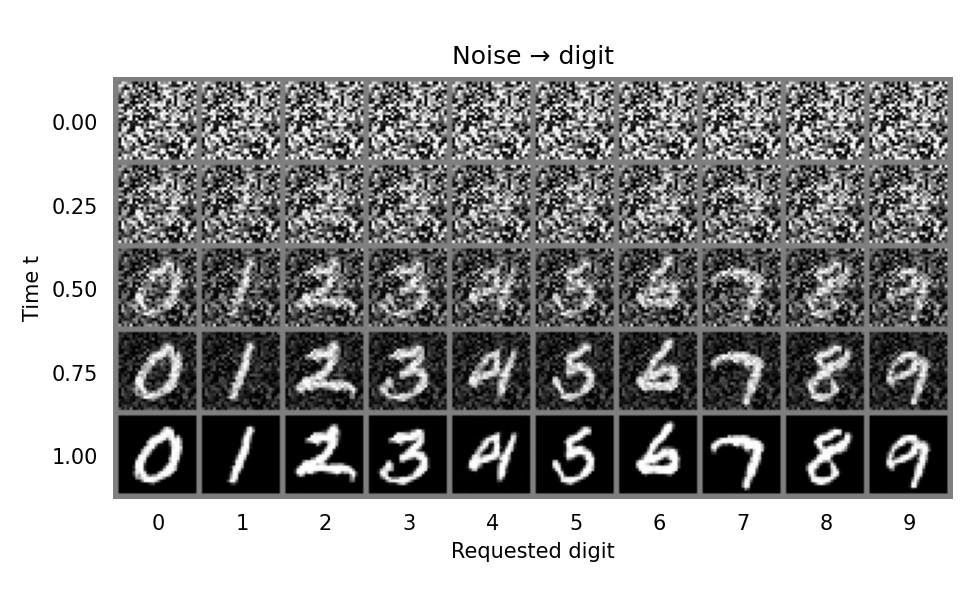

# 02 · Conditional MNIST Flow Matching

Generate digits 0–9 with a class-conditional U-Net.
Each block receives `time_embedding(t) + label_embedding(y)`.
Images stay `[B, 1, 28, 28]`, with pixels scaled to [-1, 1].

## Model

Default channel counts are shown below; image tensors use [B, C, H, W], where B is the batch size.
Dashed arrows supply the same time/class condition to all five blocks.



The output is a velocity field; Euler integration turns noise into a digit.

### Inside a ConditionalBlock



The first `+` adds the projected condition at every pixel. The second `+` adds the residual features element by element.
Both are additions; the U-Net's encoder-to-decoder skips use concatenation. This block keeps H × W unchanged.

## Setup

```bash
cd 02-conditional-mnist
conda activate flow-matching
pip install -r requirements.txt
```

MNIST downloads to `data/` on the first training run.

## Train

```bash
python train.py --steps 3000 --device mps
```

Use `mps` on Mac, `cuda` on NVIDIA, or `cpu` (default).
Batch size 128 · base channels 32 · learning rate 3e-4 · gradient clipping 1.0.
Saves `model.pt`, `config.json`, and `summary.png` to `runs/`.
Longer runs save intermediate inference checkpoints every 5,000 steps.

## Eval

Use a checkpoint trained with this conditional model.

```bash
# All digits: 10 columns, 5 samples per digit
python eval.py runs/<run>/model.pt --device mps --ode-steps 128 --samples-per-class 5

# Select digits
python eval.py runs/<run>/model.pt --device mps --digits 3 7
```

Saves `euler_128.png` and `trajectory_128.png` beside the checkpoint.
Columns are labeled with the requested digit. Each row shares the same initial noise across classes.
Trajectory columns show one shared noise sample becoming each requested digit, with time increasing downwards.
Rerunning eval with the same step count replaces these PNGs.

## Result

3,000 training steps on MPS · 128 Euler steps · sampling seed 2026.
Each column requests one digit, from 0 to 9, with five samples per digit. Some samples still have incomplete strokes.



The same initial noise becomes a different digit in each column. Time increases from top to bottom.


